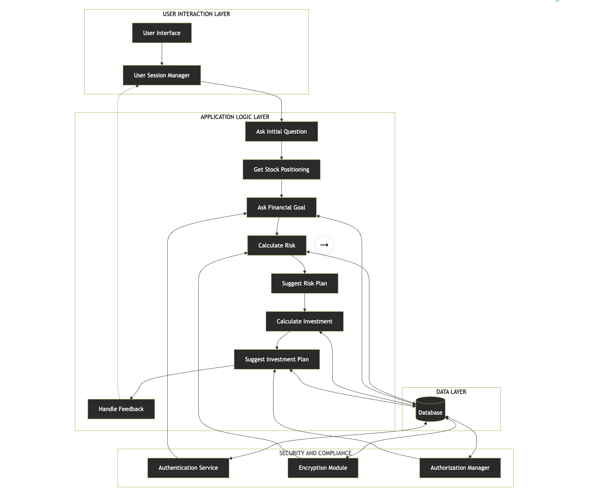

## Project Illustration


### **FinancialNexus_Agentic_AI**

---

#### **Overview**
FinancialNexus_Agentic_AI is a cutting-edge **Agentic AI** platform that revolutionizes financial advisory services through the power of **Large Language Models (LLMs)**, **Retrieval-Augmented Generation (RAG)**, and **Autonomous AI Agents**. This next-generation system combines **Microsoft Fabric Lakehouse**, **Vector Databases**, and **LangChain Agents** to deliver personalized financial planning and portfolio management services with unprecedented intelligence and automation.

The platform leverages **Generative AI** and **Machine Learning** to enable natural language interactions with financial data, making sophisticated financial analysis accessible for both financial professionals and individual investors through **Conversational AI**.

The platform features:
- **Agentic AI** with autonomous decision-making capabilities
- **Conversational AI** with memory and context awareness
- **Natural Language Database Queries** using **RAG-to-SQL**
- **Personalized Investment Planning** powered by **AI/ML algorithms**
- **Risk Assessment and Analysis** with **predictive analytics**
- **Web-based Interface** with **real-time AI responses**
- **Vector Database** for semantic search and memory
- **Multi-modal AI** integration for comprehensive analysis

### **System Architecture**

The following diagram illustrates the architecture of the FinancialNexus_Agentic_AI platform:



#### **Architecture Overview**

- **User Interaction Layer**:  
  The web interface (Flask + HTML) allows users to interact with the system.  
  User sessions are managed via unique user IDs.

- **Application Logic Layer**:  
  The core business logic is implemented as modular tools (Ask Initial Question, Get Stock Positioning, Ask Financial Goal, Calculate Risk, Suggest Risk Plan, Calculate Investment, Suggest Investment Plan, Handle Feedback).  
  These tools are orchestrated by a LangChain agent, enabling agentic AI workflows and adaptive reasoning.

- **Data Layer**:  
  All data is stored and managed in Microsoft Fabric Lakehouse and/or Azure SQL Database.  
  The RAG system and agent tools interact with the database for data retrieval and storage.

- **Security and Compliance**:  
  Authentication is handled via Azure token-based authentication.  
  Encryption and authorization are managed by Azure/Microsoft Fabric infrastructure, ensuring enterprise-grade security and compliance.

#### **Component Alignment Table**

| Diagram Component         | Codebase Implementation                                                                 |
|--------------------------|-----------------------------------------------------------------------------------------|
| User Interface           | `templates/index.html`, Flask app in `app.py`                                           |
| User Session Manager     | `user_id` in API, session logic in frontend/backend                                     |
| Application Logic Layer  | All tools in `Agent/tools.py`, orchestrated by LangChain agent in `Agent/agent.py`      |
| Database                 | Microsoft Fabric Lakehouse/Azure SQL, accessed via RAG and data insertion scripts       |
| Authentication Service   | Azure token-based authentication in `connection.py` and `Credentials.py`                |
| Encryption Module        | Handled by Azure/Microsoft Fabric (not custom code, but part of cloud infra)            |
| Authorization Manager    | Azure SQL/Fabric permissions, token-based access                                        |
| Security & Compliance    | Inherited from Azure/Microsoft Fabric best practices                                    |

---

### **Microsoft Fabric Lakehouse**

**Microsoft Fabric Lakehouse** serves as the centralized **data lake** and **data warehouse** for all financial information including clients, portfolios, assets, transactions, and risk assessments. The Lakehouse provides:

- **Scalable Storage**: Handles **big data** efficiently with **distributed computing**
- **Real-time Analytics**: Enables **streaming analytics** and **real-time dashboards**
- **Data Integration**: Seamless connection with **AI/ML models** and **MLOps pipelines**
- **Security**: **Enterprise-grade data protection** with **zero-trust architecture**
- **Data Governance**: **Compliance-ready** with **data lineage** tracking

The database schema includes comprehensive tables for wealth management operations, supporting **predictive analytics**, **risk modeling**, and **algorithmic trading** capabilities.

---

### **Data Setup and Management**

#### **Database Schema**
The project includes **SQL scripts** to create the complete database structure with **normalized data models**:

```bash
# Create database tables with optimized schema
# Run the SQL scripts in CreateDataWarehouse/CreatingTables.sql
```

#### **Data Population**
Insert **synthetic data** to test the system with **real-world scenarios**:

```bash
# Insert 1GB of dummy data for comprehensive testing
python CreateDataWarehouse/InsertToSQL.py
```

**Required Dependencies**: `pyodbc`, `faker`, `pandas`, **data engineering** tools

---

### **RAG-to-SQL System**

The **Retrieval-Augmented Generation (RAG) to SQL** system represents the cutting edge of **Natural Language Processing (NLP)** and **database interaction**. This **AI-powered** system converts natural language questions into **optimized SQL queries**, enabling users to interact with financial data through **conversational interfaces** without SQL knowledge.

#### **Key Features**
- **Natural Language Processing**: Advanced **NLP models** understand financial terminology
- **Context-Aware Queries**: **Semantic understanding** maintains conversation context
- **Schema Understanding**: **Knowledge graphs** trained on database structure
- **Dynamic Query Generation**: **Real-time SQL generation** with **query optimization**
- **Vector Search**: **Semantic similarity** for enhanced retrieval
- **Few-shot Learning**: **Adaptive learning** from user interactions

#### **Training Process**
```bash
# Train the RAG model on database schema and documentation
# Uses advanced fine-tuning techniques
python FinancialGoals/RAGToSQL/TrainRAG.py
```

#### **Usage**
```bash
# Run inference for natural language queries
# Powered by state-of-the-art LLMs
python FinancialGoals/RAGToSQL/InferenceRAG.py
```

---

### **LangChain Agent System**

The **LangChain Agent** provides **autonomous AI** capabilities with **multi-agent orchestration**:

#### **Core Components**
- **Memory Management**: **Persistent conversation history** using **Chroma vector database**
- **Tool Integration**: **Specialized financial analysis tools** with **API orchestration**
- **Intent Detection**: **AI-powered classification** of user requests
- **Context Awareness**: **Semantic memory** maintains user portfolio and goal information
- **Chain of Thought**: **Multi-step reasoning** for complex financial decisions
- **Agent Orchestration**: **Multi-agent collaboration** for comprehensive analysis

#### **Available Tools**
- **Get Stock Positioning**: **Real-time portfolio data** retrieval with **market intelligence**
- **Calculate Investment Plan**: **AI-generated investment strategies** with **risk optimization**
- **Risk Analysis**: **Advanced risk metrics** with **Monte Carlo simulations**
- **Financial Goal Planning**: **Goal-based investing** with **predictive modeling**

#### **Memory Features**
- **User-specific Storage**: **Isolated memory** per user with **privacy protection**
- **Portfolio Data Persistence**: **Special markers** for **semantic retrieval**
- **Conversation History**: **Context-aware responses** with **memory consolidation**
- **Vector Embeddings**: **High-dimensional representations** for **semantic search**

---

### **Web Application**

#### **Flask-based Interface**
- **REST API**: `/conversation/` endpoint for **real-time chat interactions**
- **Simple Web UI**: **User-friendly chat interface** with **responsive design**
- **Session Management**: **User-specific conversations** with **state management**
- **Real-time Responses**: **Immediate AI feedback** with **streaming responses**
- **WebSocket Support**: **Real-time communication** for **live updates**

#### **Usage**
```bash
# Start the web application with production-ready configuration
python app.py
```

Access the interface at: `http://localhost:7001`

---

### **Prerequisites**

1. **Python 3.9+** with **virtual environment** support
2. **Microsoft Fabric Lakehouse Access** with **enterprise connectivity**
3. **OpenAI API Key** for **GPT-4/GPT-3.5** integration
4. **Azure Credentials** for **cloud-native** deployment
5. **SQL Server ODBC Driver** for **database connectivity**

### **Installation & Setup**

#### **1. Environment Setup**
```bash
# Create virtual environment with Python 3.9+
python3.9 -m venv venv

# Activate environment
# Windows:
venv\Scripts\activate
# Linux/Mac:
source venv/bin/activate

# Install dependencies with latest AI/ML packages
pip install -r requirements.txt
```

#### **2. Configuration Setup**
```bash
# Run the setup script to initialize configuration
python setup.py

# This will:
# - Create .env file from template
# - Validate package installation
# - Check configuration status
```

#### **3. Configure Credentials**
Edit the `.env` file with your actual credentials:

```bash
# OpenAI Configuration
OPENAI_API_KEY=your-actual-openai-api-key
OPENAI_MODEL=gpt-4o-mini

# Microsoft Fabric Lakehouse Configuration
FABRIC_SQL_ENDPOINT=your-fabric-lakehouse.fabric.microsoft.com
FABRIC_DATABASE=your-database-name
FABRIC_RESOURCE_URL=your-resource-url
FABRIC_TOKEN=your-azure-token

# Azure SQL Database Configuration (for data insertion)
AZURE_SQL_SERVER=your-azure-sql-server.database.windows.net
AZURE_SQL_DATABASE=your-database-name
AZURE_SQL_USER=your-username
AZURE_SQL_PASSWORD=your-password
AZURE_SQL_PORT=1433

# Application Configuration
APP_PORT=7001
APP_DEBUG=True
```

#### **4. Validate Configuration**
```bash
# Validate that all required configuration is set
python config.py
```

#### **5. Database Setup**
```bash
# Create database tables with optimized schema
# Run CreatingTables.sql in your Microsoft Fabric Lakehouse

# Insert sample data for comprehensive testing
python CreateDataWarehouse/InsertToSQL.py
```

#### **6. Train RAG Model**
```bash
# Train the Text-to-SQL model with advanced fine-tuning
python FinancialGoals/RAGToSQL/TrainRAG.py
```

#### **7. Start Application**
```bash
# Launch the web application with production configuration
python app.py
```

---

### **Configuration Management**

The application uses a **centralized configuration system** for security and flexibility:

#### **Security Features:**
- **Environment Variables**: All sensitive data stored in `.env` files
- **Git Ignored**: `.env` files are excluded from version control
- **Template System**: `.env.template` provides safe configuration structure
- **Validation**: Automatic configuration validation on startup

#### **Configuration Files:**
- `config.py` - Centralized configuration class
- `.env.template` - Template for environment variables
- `.env` - Your actual credentials (not in version control)
- `setup.py` - Automated setup and validation script

#### **Environment Variables:**
All configuration is managed through environment variables, making the application:
- **Deployment Ready**: Easy to deploy to different environments
- **Security Compliant**: No hardcoded credentials
- **Scalable**: Configuration can be managed externally
- **Flexible**: Easy to switch between development/staging/production

---

### **Usage Examples**

#### **Portfolio Analysis**
```
User: "Show me my current portfolio performance with risk metrics"
Agent: Retrieves portfolio data and provides comprehensive analysis with AI-powered insights
```

#### **Investment Planning**
```
User: "I want to save $500,000 for retirement in 15 years with optimal risk-adjusted returns"
Agent: Analyzes current portfolio and creates AI-optimized investment plan with Monte Carlo simulations
```

#### **Risk Assessment**
```
User: "What's the risk level of my current investments and suggest diversification strategies?"
Agent: Calculates advanced risk metrics and provides AI-recommended diversification strategies
```

---

### **Key Features**

- **Natural Language Interface**: **Zero-code** interaction with **AI-powered** understanding
- **Personalized Recommendations**: **User-specific portfolio analysis** with **machine learning**
- **Memory Persistence**: **Semantic memory** maintains conversation context
- **Real-time Data Access**: **Live portfolio** and **market data** with **streaming analytics**
- **Risk Management**: **Automated risk assessment** with **predictive modeling**
- **Goal-based Planning**: **Financial goal tracking** with **AI optimization**
- **Multi-modal AI**: **Text, data, and analytics** integration
- **Autonomous Decision Making**: **Agentic AI** capabilities for **intelligent automation**

---

### **Architecture Benefits**

- **Scalable**: **Microsoft Fabric Lakehouse** handles **big data** with **distributed computing**
- **Secure**: **Enterprise-grade authentication** with **zero-trust security**
- **Intelligent**: **AI-powered analysis** with **predictive analytics**
- **User-friendly**: **Natural language interaction** with **conversational AI**
- **Extensible**: **Modular design** for **easy feature additions** and **MLOps integration**
- **Cloud-native**: **Microservices architecture** with **containerization** support
- **Real-time**: **Streaming analytics** with **event-driven architecture**

---

### **Technology Stack**

- **AI/ML**: **OpenAI GPT-4**, **LangChain**, **Vector Databases**
- **Data**: **Microsoft Fabric Lakehouse**, **SQL Server**, **Pandas**
- **Web**: **Flask**, **REST APIs**, **WebSocket**
- **Memory**: **Chroma Vector Database**, **Semantic Search**
- **Cloud**: **Azure**, **Microsoft Fabric**, **Cloud-native** deployment

---

### **Support & Documentation**

For technical support or questions:
1. Check the **training artifacts** in `FinancialGoals/RAGToSQL/TrainingRAG-Artifact/`
2. Review the **database documentation** in `Documentation.txt`
3. Examine the **training summary** in `training_summary.csv`
4. Access **API documentation** and **integration guides**

---

### **License**

This project is designed for **educational** and **demonstration** purposes in **financial technology** and **AI applications**. Built with **open-source** technologies and **enterprise-grade** architecture.